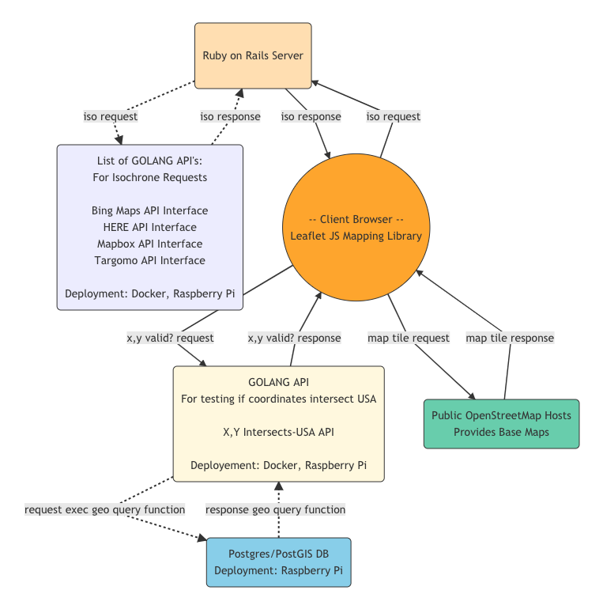

# MappyAsync

*This Project is under development.*

Scope:  Display a map and allow for the creation of isochrone (drive time) polygons.
#
Goals:  Create microservices to off load processing from the server.  Use asynchronous coding where possible.
#
The following are a list of API microservices this project uses.  The API's are writen in GOLANG and are granular and very narrowly defined.  The API's are deployed to Raspberry Pi's as docker containers.  The API's are used to off load work from the server.
    
    - https://github.com/greghorne/go-api-intersect-usa
    - https://github.com/greghorne/go-api-bing
    - https://github.com/greghorne/go-api-here
    - https://github.com/greghorne/go-api-mapbox
    - https://github.com/greghorne/go-api-targomo

#

Tech Stack:

	- Leaflet v1.3.3

    - Rails 5.2.0
    - Ruby  2.5.1p57

    - PostgreSQL 9.4.15
    - PostGIS    2.1.4 r12966

    - Dev Machine - Vagrant Box: Ubuntu 14.04.5 LTS x86

#
Layout:

